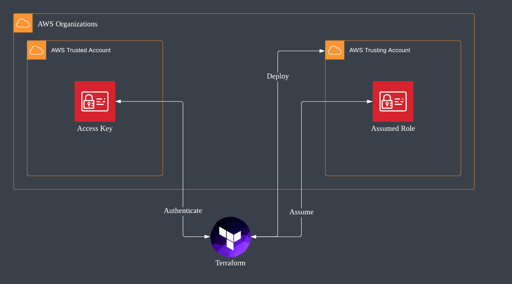
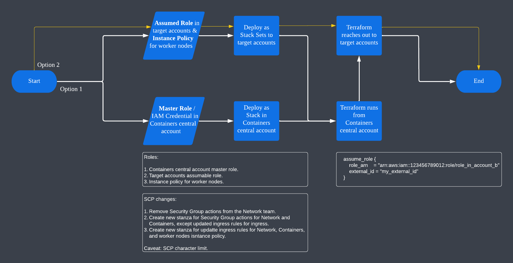

# terraform-vcs-cross-account

Deploy resources into AWS across accounts using Terraform. Only one (1) set of IAM credentials needed while the rest of the connections are made by assuming a trusting role in target accounts.

## Role Assumption

## Sample Workflow

